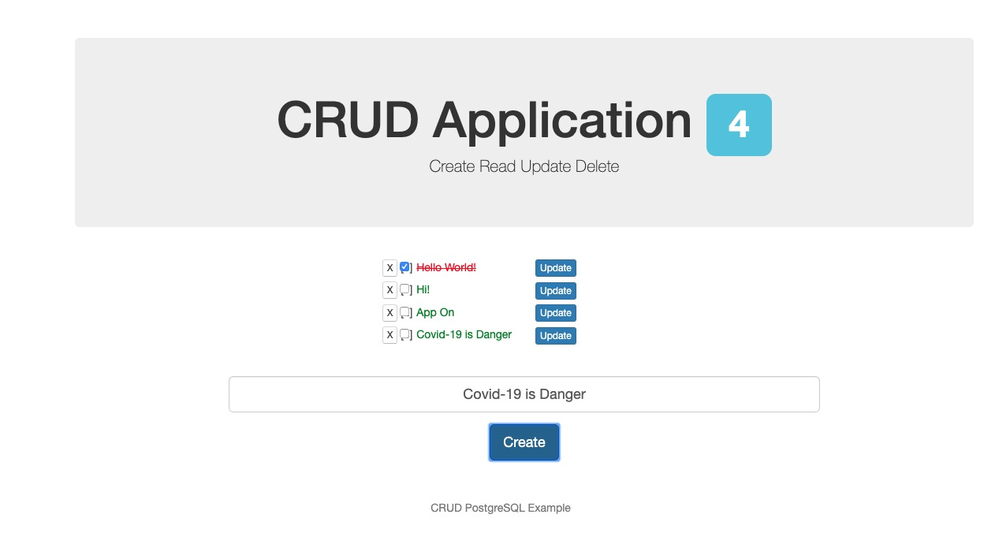

# DOCKER - Conceitos Iniciais

Material de Estudo!

- [x] Conceitos Iniciais
    - [x] Instalando o Docker
    - [x] Verificar a Versão
    - [x] Verificar Informações
    - [x] Primeiro Projeto
    - [x] Downloads de Imagens
    - [x] Rodando um container
    - [x] Rodar em Foreground
    - [x] Parar um container
    - [x] Visualizar containers parados
    - [x] Dar um nome ao container
    - [x] Apagar Container
    - [x] Mostrar detalhes da configuração do container
    - [x] Mostrar estatísticas de performance dos containers
    - [x] Analisando o "docker container run"
    - [x] Executar um comando dentro de um container
    - [x] Renomear um Container
- [x] Super Containers
    - [x] Container Prune - Remover Todos os Containers
    - [x] RMI - Remover uma ou mais imagens
- [x] Cloud 9
- [x] Volumes
- [x] NVM - Node Version Manager
- [x] Docker Container Commit
- [x] Docker Image History - Camadas de uma imagem
- [x] Acesso SSH
- [x] Formatos
- [x] Rodando um servidor HTTP com Node.JS
- [x] Analizando "docker network"
- [x] Conhecendo a imagem do Postgres
- [x] Analizando o "docker image tag"
- [x] CRUD Node.JS + Postgres em 2 containers

## *Conceitos Iniciais*

### Verificar a versão

`$ docker -v`


### Verificar Informações
`$ docker info`


### Primeiro Projeto

```bash
$ docker run hello-world
$ docker images
```


### Downloads de Imagens
[Hub Docker](https://hub.docker.com/)

```bash
$ docker pull nginx
$ docker pull nginx:alpine
```


### Rodando um container

```bash
$ docker container run --publish 8080:80 nginx
$ docker container run -p 8080:80 nginx
$ docker container run -p 8080:80 nginx:alpine
```


### Rodar em Foreground

```bash
$ docker container run -p 8080:80 --detach nginx
$ docker container run -p 8080:80 -d nginx
```


### Parar um container

```bash
$ docker container ls
$ docker container stop 329a4a4f1723
```


### Visualizar containers parados

```bash
$ docker conteiner ls -a
```


### Dar um nome ao container

```bash
$ docker container run --publish 8080:80 --detach --name webserver nginx
$ docker container run -p 8080:80 -d -n webserver nginx
```


### Apagar Container

```bash
$ docker container rm 98e
$ docker container rm uuid01 uuid02 uuid03
```


### Mostrar detalhes da configuração do container

```bash
$ docker container inspect <container id>
```


### Mostrar estatísticas de performance dos containers

```bash
$ docker container stats
```


### Analisando o "docker container run"
[Doc - Docker Container Run](https://docs.docker.com/engine/reference/commandline/container_run)

Baixar a Imagem

```bash
$ docker pull ubuntu
```

Rodar o terminal dentro do container ubuntu
```bash
$ docker container run -it ubuntu /bin/bash
$ ll
$ ls
$ apt-get update
$ apt-get install git
$ git --version
$ exit
$ docker container start 272b4dc08fbe
$ docker container attach 272b4dc08fbe
$ exit
```


### Executar um comando dentro de um container
```bash
$ docker container start 272b4dc08fbe
$ docker container exec 272b4dc08fbe ls -la
$ docker container exec 272b4dc08fbe git --version
$ docker container stop 272b4dc08fbe
```


### Renomear um Container
Para dar nome a um container use a opção --name
```bash
$ docker container run --publish 8081:80 --detach --name webserver ngginx
$ docker container ls
$ docker container ls -a
$ docker container rename 272b4dc08fbe initial_ubuntu
```


## Super Containers
### Container Prune - Remover Todos os Containers
[Doc - Docker Container Prune](https://docs.docker.com/engine/reference/commandline/container_prune/)

```bash
$ docker container prune
```

### RMI - Remover uma ou mais imagens
[RMI](https://docs.docker.com/engine/reference/commandline/rmi/)

```bash
$ docker rmi 272b4dc08fbe
$ docker rmi 272b4dc08fbe 372b4dc08fbe
```

Porém também podemos remover uma ou mais imagens/containers com o comando

```bash
$ docker image rm <image id>
$ docker container rm <container id>
```


## Cloud 9
[AWS - Cloud 9](https://aws.amazon.com/pt/cloud9/)
[AWS - Github - Cloud 9](https://github.com/c9/core)

Para isso vou utilizar o a imagem do Docker Hub
[Docker Hub - sapk/cloud9](https://hub.docker.com/r/sapk/cloud9)

```bash
$ docker pull sapk/cloud9
```

Formato das portas é sempre:
- portaLocal:portaDocker -> Ex.: 3000:8181
- Onde a porta 3000 vai ser utilizada no seu endpoint, por exemplo http://localhost:3000
- E a porta 8181 é a porta que será utilizada internamente pelo docker

Para rodar o Docker em um caminho virtual
- Retiramos o a opção *-v* e *$(pwd):* que seria o seu caminho local, que poderia ser por exemplo *C:\users\username\desktop\diretorio* no Windows, ou */users/username/desktop/diretorio* no Mac
- E o */workspace* que seria o seu diretório local dentro do *$(pwd):*
- No entanto os arquivos só podem ser acessados dentro do container, e caso esse container seja apagado, seu diretório será perdido

```bash
$ docker run -d -p 3000:8181 sapk/cloud9 --auth docker:docker
```

- Agora podemos acessar o endpoit http://localhost:3000

No entanto, para que o *Docker crie os arquivos em seu disco local*, e você tenha acesso a esses arquivos caso o container seja apagado, rodamos o seguinte comando:

```bash
$ docker run -d -v $(pwd):/workspace -p 3000:8181 sapk/cloud9 --auth username:password
```

Dentro do endpoint: http://localhost:3000 podemos atualizar a máquina ubuntu por exemplo

```bash
$ apt-get update
```

E para instalarmo as dependencias de um projeto podemos rodar o comando:
```bash
npm install --no-bin-links
```

Voltando ao terminar podermos listar os containers

```bash
$ docker container ls
```

## Volumes
[Doc - Docker Volumes](https://docs.docker.com/storage/volumes/)

Para isso vamos verificar as imagens e containers disponíveis:

```bash
$ docker volume ls
$ docker container ls
```

Para inspecionar uma imagem no docker, podemos rodar o comando:

```bash
$ docker image inspect <image id>
```

Para inspecionar um container específico, rodamos o comando:

```bash
$ docker container inspect <container id>
```

> No meu caso vou rodar os comandos:
```bash
$  docker volume inspect 7fe1329ba98cdc051ad4d4efaacb6f2352e741a1236017a75782c2921663eb4f
$ docker container inspect 25448096fc0f
```
- Nesse ponto, podemos verificar que foi realizado a cópia de todo o app de forma local, para isso vamos verificar o objeto Mounts dentro do comando inspect

Agora podemos caso queiramos, podemos remover nossa imagem com o comando:

```bash
docker volume rm 7fe1329ba98cdc051ad4d4efaacb6f2352e741a1236017a75782c2921663eb4f
```


## NVM - Node Version Manager
[NVM - Github](https://github.com/creationix/nvm)

Agora precisamos instalar o curl ou o wget, eu vou instalar o curl mesmo, e para isso rodamos o comando:
```bash
apt-get install curl
```
Agora podemos instalar o NVM
```bash
$ curl -o- https://raw.githubusercontent.com/nvm-sh/nvm/v0.35.3/install.sh | bash
```

Agora podemos rodar os comandos:
```bash
$ command -v nvm
$ source ~/.bashrc
```

*NVM - Comandos Úteis*
```bash
$ nvm ls //Lista versões instaladas
$ nvm ls-remote //Lista versões disponíveis
$ nvm install <version> //Instala versão desejada
$ nvm use <version> //Usa determida versão do node
$ nvm current //verifica versão que está sendo usada
```


## Docker Container Commit
[Doc - Docker Container Commit](https://docs.docker.com/engine/reference/commandline/container_commit/)

Aqui podemos criar containers a partir de versões de container já modificados
- Padrão: $ docker container commit [OPTIONS] CONTAINER [REPOSITORY[:TAG]]

```bash
docker container commit -m "NVM + Curl" <container id>
```

Vamos apagar todos os containers
```bash
$ docker container prune -y
```

Iniciar uma nova imagem
```bash
docker image ls
docker run -d -v $(pwd):/workspace -p 8181:8181 <novaimagem id> --auth username:password
```


## Docker Image History - Camadas de uma imagem
[Doc - Docker Image History](https://docs.docker.com/engine/reference/commandline/image_history/)
- Padrão: $ docker image history [OPTIONS] IMAGE

Para verificar o histórico de uma imagem rodamos o comando:
```bash
$ docker images
$ docker image hystory <imagesemcommit id>
$ docker image history ab7c2cf697db
```


## Acesso SSH
[Docker Hub - Ubuntu SSHD](https://hub.docker.com/r/rastasheep/ubuntu-sshd/)

Vamos baixar a imagem com o comando:
`$ docker pull rastasheep/ubuntu-sshd`

Veja a segui que com a letra *-P* maiúsculo indicamos que a porta será escolhida de forma automática, diferentemente de *-p* minúsculo onde deve ser setada a porta
```bash
$ sudo docker run -d -P --name test_sshd rastasheep/ubuntu-sshd:14.04
```

Agora podemos inspecionar esta imagem:
```bash
$ docker image inspect <image id>
```
>No meu caso:
```bash
$ docker image inspect 49533628fb37
```

E podemos verificar a porta exposta no objeto ExposedPorts, nesse caso é a porta padrão 22/tcp
Para iniciarmos essa imagem rodamos o comando:

```bash
$ docker run -d -P 49533628fb37
```

Agora para verificar em qual porta esta mapeada para podemos usar essa image, podemos usar o *Docker Port*
- Padrão: $ docker port CONTAINER [PRIVATE_PORT[/PROTO]]

Para isso rodamos o comando:

```bash
$ docker container ls
```

Agora podemos rodar o comando:

```bash
$ docker port <container id>
```

> No meu caso:

```bash
$ docker port 6c2d95465a80
```

Indicando que a porta que foi selecionada: 22/tcp -> 0.0.0.0:32768
- Ainda podemos ver a porta mapeada diretamente no 22/tpc

```bash
$docker port 6c2d95465a80 22
```

E o retorno será exatamente o mesmo, no entanto, também podemos verificar a porta usada de forma mais rápida rodando o comando:

```bash
$ docker container ls
```

- E verificar diretamente em PORTS


Agora para acessar o SSH:

```bash
$ ssh root@localhost -p <port> -y
```

> No meu caso:

```bash
$ ssh root@localhost -p 32768 -y
```

Utilizando o *usuário: root* no servidor local, e com a *senha padrão: root*
Trata-se de uma máquina ubuntu, e podemos verificar os diretórios com o comando:

```bash
$ ls /
```

Agora podemos sair a qualquer momento com o comando:

```bash
exit
```

E retornar para dentro do container a qualquer momento com o comando:

```bash
$ ssh root@localhost -p 32768
```

## Formatos
[Doc - Docker Formatting](https://docs.docker.com/engine/admin/formatting/)

- Padrão: $ docker inspect --format '{{join .Args " , "}}' container

Um exemplo de como filtra informações é:

```bash
$ docker image inspect --format'{{.Config.ExposedPorts}}' <iamge id>
```

> No meu caso ficou assim:

`docker image inspect --format'{{.Config.ExposedPorts}}' ab7c2cf697db`

- E o retorno foi: map[22/tcp:{}]

## Rodando um servidor HTTP com Node.JS

Para isso primeiramente vamos levanta nossa imagem Cloud 9

`$ docker run -d -v $(pwd):/workspace -p 8181:8181 <imagem id> --auth username:password`

Acessando o endpoint, podemos criar um arquivo com nosso servidor:

###### server.js
```javascript
const http = require('http')
const port = 3030
const ip = '0.0.0.0' //localhost

const server = http.createServer((req, res) => {
    res.end('Hello world!')
})

server.listen(port, ip, () => {
    console.log(`Servidor rodando em http://${ip}:${port}`)
})
```

Agora com nosso arquivo salvo podermos tentar rodar nosso servidor, para isso vamo rodar o comando:

`$ node server.js`

- Já podemos tentar acessar nosso endpoint em `http://localhost:3000`

- Note que não é possivel rodar esse serviço quando tentamos acessar este endpoint, pois rodamos nossa imagem utilizando somente a porta externa ao docker `-p 8181:8181` e estamos tentando acessar a porta `-p 3000:3000`, para isso vamos rodar os comandos:

```bash
$ docker container stop <container id>
$ docker run -d -v $(pwd):/workspace -p 8181:8181 -p 3030:3030 <imagem id> --auth username:password
```

- Agora podemos acessar nosso endpoint em `http://localhost:3030` e vai estar disponível fora do container do docker

- Agora podemos acessar no SSH

```bash
$ docker container stop <container id>
$ docker container run -d -v $(pwd):/root -P -p 3030:3030 <image id>
```
Agora podemos verificar as portas disponíveis

`$ docker port <container id>`

Neste caso obtive o seguinte retorno:

```bash
22/tcp -> 0.0.0.0:32769
3030/tcp -> 0.0.0.0:3030
```

E então podemos acessar o SSH com o usuário e senha `root`, para isso vamos rodar o comando:

`$ ssh root@localhost -p 32769`

Neste ponto já estamos dentro de nosso ssh, então podemos verificar o diretório que estamos:

`$ pwd`

E vamos rodar o comando `$ ls -la` para verificarmos se temos o bash_profile, no meu caso não tenho, e para isso preciso rodar o comando:

```bash
$ apt-get update
$ apt-get install curl
$ touch ~/.bash_profile
$ curl -o- https://raw.githubusercontent.com/nvm-sh/nvm/v0.35.3/install.sh | bash
$ source ~/.bash_profile
$ nvm --version
$ nvm install 9.9.0
```

Pronto, agora podemo listar nossos arquivos com o comando `ls` e entrar em nosso diretório com o `server.js` e rodar o comando:

`node server.js`

Agora já estamos rodando nosso servidor localmente no endpoint `http://localhost:3030` e podemos ver tudo funcionando e com acesso pelo ssh

Também podemos fazer um commit neste container para ficarmos somente com o container modificado, para isso:

`$ docker commit -m "Adicionado Curl e NVM" <container id>`


## Analisando "docker network"
[Doc - Docker Network](https://docs.docker.com/engine/userguide/networking/)

Para iniciarmos vamos rodar 3 containers:

```bash
$ docker run -d -v $(pwd):/workspace -p 8181:8181 --name cloud81 <imagem id> --auth username:password
$ docker run -d -v $(pwd):/workspace -p 8182:8181 --name cloud82 <imagem id> --auth username:password
$ docker run -d -v $(pwd):/workspace -p 8183:8181 --name cloud83 <imagem id> --auth username:password
```

Para verificarmos as redes disponiveis no docker, rodamos o comando:

`$ docker network ls`

E vamos ter o seguinte resultado

|NETWORK ID    |NAME      |DRIVER     |SCOPE|
|--------------|----------|-----------|-----|
|addex00c152a  |bridge    |bridge     |local|
|5f98x0fa989f  |host      |host       |local|
|c45dx06a0594  |none      |null       |local|

E por padrão o docker usar a bridge, e esse é o nosso foco, então vamos inspecionar nossa network:

`$ docker network inspect bridge`

Temos o retorno do objeto Containers, e nele podemos ver os containers que estão rodando, e no objeto IPv4Address podemos verificar o IP de cada uma das redes criadas, assim, podemos detro do cloud9 de uma das maquinas dar um ping para a outra, por exemplo se estamos na `172.17.0.3` podemos rodar um comando de ping para o `172.17.0.1`:

`ping 172.17.0.1`

Também podemos conectar ou desconectar a uma rede em tempo de execução, para isso vamos rodar o comando:

```bash
$ docker network connect <network> <container>
$ docker network disconnect <network> <container>
```

Por exemplo que desconectar o container `cloud81` da rede, para isso vou rodar o comando:

`$ docker network disconnect bridge cloud81`

Agora se inspecionarmos a bridge novament veremos que o cloud81 foi desconectado:

`$ docker network inspect bridge`

Podemos reconecta-la

```bash
$ docker network connect bridge cloud81
$ docker network inspect bridge
```

Também podemos criar e remover uma rede
```bash
$ docker network create <network_name>
$ docker network rm <network_name>
```

Por exemplo:
```bash
$ docker network create myNetwork
```

Agora podemos lista as redes:
`$ docker network ls`

E inspecionar essa rede:
`$ docker network inspect myNetwork`

Sendo assim, cada container pode estar em mais de uma rede, porém cada container só tem conexão com os container com as redes que este pertence.

```bash
$ docker network connect myNetwork cloud81
$ docker network inspect bridge
```

Agora vamos desconectar e remover essa network

```bash
$ docker network disconnect bridge cloud81
$ docker network rm myNetwork
```

Desta forma, podemos criar uma rede, ou utilizar a rede padrão

Mas também podemos conectar um container a uma rede específica, para isso vou da um `stop` em todos os containers, e mostrar um exemplo:

```bash
$ docker container stop cloud81 cloud82 cloud83
$ docker container prune
```

Vou criar uma nova rede
```bash
$ docker network create myNetwork
```

Vou iniciar um novo container diretemente nessa rede, para isso:

```bash
$ docker run -d -v $(pwd):/workspace -p 8181:8181 --name cloud8181 --network myNetwork sapk/cloud9 --auth username:password
```

Agora podemos inspecionar essa rede
```bash
$ docker network inspect myNetwork
```

Podemos ver que conectamos nosso container diretamente a essa rede
Agora vamos desconectar, remover a rede

```bash
$ docker network disconnect myNetwork cloud81
$ docker network rm myNetwork
$ docker container stop cloud81
$ docker container prune
$ docker network ls
```

E por fim, temos nossa configuração padrão novamente

## Conhecendo a imagem do Postgres
[Docker Hub - Pastgres](https://hub.docker.com/_/postgres/)

Para iniciar vamos baixar a imagem do Postgres
```bash
$ docker pull postgres
```

Vamos iniciar o container do Postgres com o usuario e senha padrão, e não vou utilizar a porta padrão 5432, vou iniciar com a opção `-P` para mapear qualquer porta
```bash
$ docker run --name postgres -e POSTGRES_PASSWORD=postgres -d -P postgres
$ docker container ls
```

Para controlar o Postgres vou utilizar o pgAdmin
[Download pgAdmin](https://www.postgresql.org/download/)

Agora podemos gerenciar o Postgres diretamente no container criado com o pgAdmin, para isso dentro do pgAdmin criamos um server com as informações que passamos e na porta mapeada
No entanto, o container postgres que criamos está está dentro de um diretório virtual, e não queremos isso, então vamos criar um novo container passando essas informações e um diretório para guardar o banco de dados, mas antes vamos rodar um inspect no container atual para pegar o caminho do banco de dados no objeto Env: PGDATA e após isso iniciarmos o novo container

```bash
$ docker container inspect <container id>
$ docker container stop <container id>
$ docker container prune
```

Temos o caminho mapeado em `/var/lib/postgresql/data`, então vamos criar um diretório chamado `db_postgres` e mapear os dados do container para dentro dessa pasta

```bash
$ mkdir db_postgres
$ docker run --name postgres -e POSTGRES_PASSWORD=postgres -d -P -v $(pwd)/db_postgres:/var/lib/postgresql/data postgres
$ docker container ls
```
Agora mesmo que este container seja parado ou excluido ainda mantemos nossos dados salvos

```bash
$ docker container stop <container id>
$ docker container prune
```

## Analisando o "docker image tag"
[Doc - Docker Image Tag](https://docs.docker.com/engine/reference/commandline/image_tag/)

- Padrão: $ docker image tag SOURCE_IMAGE[:TAG] TARGET_IMAGE[:TAG]

Para renomear uma imagem sem nome precisamos ver a imagem que queremos renomear, para isso:

```bash
$ docker images
$ docker image history <image id>
```

Vamos pegar a imagem com Cloud9 em que instalamos o NVM

```bash
$ docker image tag <image id> username_dockerhub/cloud9_nvm:versao
```

No meu caso ficou:
```bash
$ docker image tag f190e19c26b8 paulorcvieira/cloud9_nvm:latest
```

Pronto, temos nossa imagem renomeada.


## CRUD Node.JS + Postegres em dois containers

Primeiramente vamos iniciar o container com o postgres e varificar a Porta e IP

```bash
$ docker run -v $(pwd)/db_postgres:/var/lib/postgresql/data -e POSTGRES_PASSWORD=postgres -d -P postgres
$ docker container ls
$ docker port <container id>
$ docker container inspect --format '{{.NetworkSettings.IPAddress}}' <container id>
```

Agora podemos levantar o Cloud9 dentro da pasta crud-node-postgres

```bash
$ docker run -d -v $(pwd)/crud-node-postgres:/workspace -p 8181:8181 -p 3030:3030 username_dockerhub/cloud9_nvm --auth username:password
```

Agora em noso browser podemos acessar `http://localhost:8181` e acessar nosso container com Cloud9

No Cloud9 vamos instalar o Bower
```bash
$ npm install -g bower
```

Vamos instalar os módulos listados no projeto em `package.json`
```bash
$ npm install
```

Instalar os módulos listados no arquivo `bower.json`
```bash
$ bower install --allow-root
```

Agora abra `../server/config/database.js` e configure os dados da sua conexão criado com o container e o IP desse container `$ docker container inspect --format '{{.NetworkSettings.IPAddress}}' <container id>`, confirme se criou a banco de dados no postgres como `crud-node` e vamos popular esse banco de dados

```bash
$ node db_setup/prepare.js
```

Podemos iniciar nosso projeto
```bash
$ node server.js
```

E então podemos acessar o endpoint de nossa aplicação em `http://localhost:3030`

Pronto! Podemos iniciar nosso projeto.

## Screenshot
##### CRUD-NODE - Online

